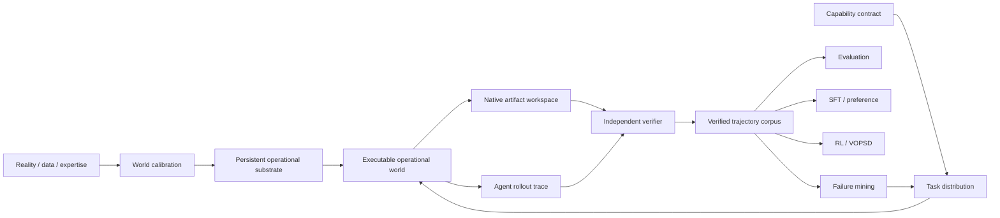

# Veritas

**A verified capability foundry for training and evaluating AI agents in persistent, executable, partially observable operational worlds.**

Veritas builds persistent operational substrates, capability contracts, calibrated world distributions, executable environments, rollout traces, independent verifiers, adversarial challenge sets, verified demonstrations, and trainer-ready bundles for SFT, preference learning, RL, and VOPSD.

The product is broader than any one benchmark family. CompanyWorld remains the first commercial evaluation wedge. Unified Operational Worlds provides one execution and verification architecture across finance/spreadsheets, enterprise operations, DevOps/incident response, investigation/OSINT, and GIS. ProjectWorld adds a separate long-horizon project-delivery environment family under the same Veritas product.

**Veritas 0.9 keeps the 4,480-case operational distribution and seven-dimensional verifier contract from 0.8, but adds real native artifacts behind the runtime.** Successful agent actions can now mutate XLSX workbooks, SQLite enterprise replicas, Kubernetes-style infrastructure bundles, heterogeneous OSINT evidence corpora, and GeoJSON/Shapely/pyproj workspaces. Native artifact checks feed back into the existing hidden target-state verifier, so correct API verbs are not sufficient when the actual artifact is wrong.

See:

- [`docs/veritas-north-star.md`](docs/veritas-north-star.md) — permanent architecture;
- [`docs/unified-operational-worlds.md`](docs/unified-operational-worlds.md) — shared operational substrate;
- [`docs/operational-production-scale.md`](docs/operational-production-scale.md) — production distribution contract;
- [`docs/domain-realism-v08.md`](docs/domain-realism-v08.md) — stateful/deep-domain semantics;
- [`docs/native-artifact-fidelity-v09.md`](docs/native-artifact-fidelity-v09.md) — native artifact execution contract;
- [`docs/projectworld-procedural-distribution.md`](docs/projectworld-procedural-distribution.md) — long-horizon construction distribution.

## What a buyer gets today

A design-partner Veritas engagement can answer deployment questions such as:

- Which model or agent harness should we deploy?
- Where does the agent fail as work becomes multi-step, cross-system, or persistent across time?
- Can the agent change the actual operational artifact correctly, not merely emit the right action names?
- Does more test-time compute improve outcomes enough to justify cost?
- Which tool or permission changes improve success without increasing unsafe actions?
- Can an agent preserve invariants and avoid harmful side effects while reaching the right final state?
- Did a new prompt, model, training run, or architecture produce a credible improvement?

A standard pilot can produce a versioned evaluation manifest, private benchmark run, capability scorecard, representative trajectories, failure analysis, cost/tool statistics where available, and prioritized recommendations.

## Capability Foundry architecture



The rollout trace, independently maintained hidden world state, and native artifact state are the sources of truth. Training examples, counterfactuals, failure labels, benchmark reports and expert demonstrations derive from versioned traces and verifier-backed state rather than separate hand-authored narratives.

## Unified operational-world substrate

`Veritas.build_company()` creates one persistent synthetic organization and mounts all five operational domains into a shared `PersistentOperationalSubstrate`:

```text
Persistent company state
  + finance / spreadsheet world
  + enterprise operations world
  + DevOps / incident-response world
  + investigation / OSINT world
  + GIS operational world
  -> append-only cross-domain events
  -> deterministic reconstruction
  -> replay / counterfactual forks
  -> independent verification
```

Every operational episode uses the same public/private contract:

- public `TaskContract`;
- agent-visible records and action specifications;
- evaluator-only hidden oracle;
- deterministic hidden action effects;
- hidden state/action preconditions;
- target-state assertions;
- final-state and trajectory-wide invariants;
- required, ordered, repeated and forbidden actions;
- evidence requirements;
- cost and tool-call budgets.

All five operational domains emit the same seven verification dimensions: **outcome, state, constraints, side effects, process, efficiency, and evidence**.

## Stateful workflow semantics

A correct action name is not enough. Hidden action effects can require prior state or prior successful actions. A syntactically valid request can be rejected when operational prerequisites are not satisfied.

Blocked actions:

- return only an agent-observable system rejection;
- do not mutate hidden truth;
- do not mutate the native artifact;
- remain visible to the harness trace as blocked attempts;
- do not satisfy required process credit.

The verifier also supports ordered process requirements, repeated required actions and trajectory-wide invariants. An agent cannot temporarily destroy a critical invariant, repair it before submission, and receive full constraint credit as if no damage occurred.

Agent-visible `OperationalRecord` objects can carry observation time, validity interval, freshness, source authority, confidence and provenance roots. Those are evidence attributes, not evaluator truth.

## Native artifact execution

`NativeOperationalRuntime` places a lazy `ParameterizedNativeArtifactWorkspace` behind an `OperationalEpisode`.

A generated episode carries a deterministic public artifact descriptor rather than embedding binary data into the benchmark bundle. The descriptor identifies the engine, format, opaque artifact ID and source-record lineage. When a rollout executes the case, Veritas materializes the actual artifact and mirrors only successful actions into it.

At submission:

1. the native artifact is independently checked;
2. native checks are written into hidden `native_artifact.*` state;
3. they are added to target-state assertions;
4. the existing seven-dimensional verifier scores the episode;
5. failed native checks are also surfaced in evaluator process violations.

This means a policy can no longer earn full outcome/state credit by performing the correct synthetic transition while leaving the real workbook/database/infrastructure/casefile/geospatial product incorrect.

### Financial / Spreadsheet

Engine: `openpyxl-workbook-v1`

Cases materialize as real `.xlsx` workbooks with input sheets, target formula/model sheets, controls and hidden artifact metadata. Actions edit the real formula cell and supported generated dependency chain. Native checks validate the generated formula, generated target enterprise value, audit state and formula-lineage preservation.

Representative procedure:

```text
inspect formula lineage
-> reconcile authoritative source balance
-> repair formula
-> recalculate
-> validate model controls
```

Artifact contract: `xlsx_formula_dependency_graph_v2`.

### Enterprise Operations

Engine: `sqlite-enterprise-replica-v1`

Cases materialize as real SQLite databases with CRM opportunities, CPQ quotes, ERP orders, IAM roles, credit profiles and audit events. Successful actions change the corresponding tables; native checks validate approval routing, order controls, bypass state and audit history.

Representative procedure:

```text
verify actor authority
-> validate credit
-> request approval
-> hold linked order
-> update workflow stage
-> reconcile CPQ / CRM / ERP state
```

Artifact contract: `crm_cpq_erp_control_graph_v2`.

### DevOps / Incident Response

Engine: `declarative-kubernetes-sandbox-v1`

Cases materialize deployment/service manifests plus executable cluster-state, alert and trace files. Recovery actions change ready replicas, generation, health and the case-specific recovered error-rate state. Harmful dependency intervention remains detectable.

Representative procedure:

```text
correlate recent change
-> inspect dependency graph
-> recover service
-> verify health
-> validate SLO window
```

Artifact contract: `incident_telemetry_dependency_graph_v2`.

### Investigation / OSINT

Engine: `rendered-evidence-corpus-v1`

Cases materialize heterogeneous evidence: registry JSON, archived HTML, directory CSV and a mutable casefile. Hypotheses, identity resolution, evidence linkage, corroboration and closure alter the actual casefile. The correct identity is derived from each generated case.

Representative procedure:

```text
record hypothesis
-> resolve candidate identity
-> link multiple evidence roots
-> corroborate independent support
-> close case
```

Artifact contract: `multi_source_provenance_casefile_v2`.

### GIS Operations

Engine: `shapely-pyproj-vector-v1`

Cases materialize source/working/overlay GeoJSON layers. Actions perform real coordinate transformation through `pyproj`, geometry repair through Shapely and geometric intersection for overlays. Native checks use each case's generated source/target CRS and preserve immutable source identity.

Representative procedure:

```text
inspect spatial metadata
-> reproject
-> repair geometry
-> validate topology
-> execute overlay
```

Artifact contract: `vector_crs_topology_lineage_v2`.

## Parameterized native fidelity

The native layer does not assume reference-case constants. Production cases vary formula ranges and values, enterprise objects, DevOps services and recovery targets, OSINT identities, and GIS CRS pairs. `ParameterizedNativeArtifactWorkspace` derives artifact values and native validation targets from the generated episode contract.

Regression coverage includes non-reference generated cases from all five domains.

## Production-scale operational distribution

`OperationalDistributionConfig()` still compiles exactly **4,480 executable episodes**:

| Split | Per domain | Total |
|---|---:|---:|
| Train | 512 | 2,560 |
| IID test | 128 | 640 |
| OOD | 128 | 640 |
| Adversarial | 128 | 640 |
| **Total** | **896** | **4,480** |

The v3 compiler preserves deterministic generation, opaque public IDs, hash-mixed public ordering, split/oracle isolation, OOD/adversarial pressure, temporal/provenance evidence, ordered/stateful procedures, trajectory invariants and anti-leakage validation.

v0.9 additionally requires every case to carry the correct native engine declaration, opaque artifact ID and public source-record lineage. The native bytes remain lazily generated rather than stored in the distribution bundle.

Full distribution integrity gate:

```bash
veritas validate-production-scale --seed 42
```

Build a distributable public/private pair:

```bash
veritas build-distribution \
  --seed 42 \
  --output operational_public.json \
  --oracle-output operational_private.json
```

## Native fidelity release gate

CI separately materializes and executes one deterministic case from every **domain × split** cell:

```text
5 domains × 4 splits = 20 native executions
```

Run it locally with:

```bash
veritas validate-native-fidelity --seed 42 --cases-per-split 8
```

For each sampled case, the evaluator-qualified procedure must execute without blocked/missing transitions, every native artifact check must pass, and the ordinary shared verifier must return state=1.0 and outcome=1.0.

This complements exhaustive descriptor/integrity checks over all 4,480 episodes.

## Product interfaces

The canonical Python product surface is `investigation_world.veritas.Veritas`. Native operational execution is available through `investigation_world.operational.NativeOperationalRuntime`.

The package installs the `veritas` CLI:

```bash
veritas capabilities
veritas domains
veritas build-world financial_spreadsheet --seed 42 --output finance.json
veritas build-suite --seed 42 --output suite.json --oracle-output private_oracles.json
veritas build-distribution --seed 42 --output public.json --oracle-output private.json
veritas validate-production-scale --seed 42
veritas materialize-native financial_spreadsheet --seed 42 --split train --case-index 0 --output-dir native_case
veritas validate-native-fidelity --seed 42 --cases-per-split 8
veritas build-company --organization-id ORG-DEMO-001 --seed 42 --output company.json
```

`materialize-native` writes the agent-facing artifact only; it does not export evaluator oracle state.

## ProjectWorld

ProjectWorld is the long-horizon project-delivery environment family. It remains separate from the short/medium `OperationalEpisode` benchmark contract rather than being silently folded into the five-domain distribution.

The current default construction distribution contains **896 projects** across train, IID, OOD and adversarial splits. Projects model design-to-handover state, resources, procurement, role authority, hidden disruptions, inspections, rework and project outcome verification.

See [`docs/projectworld-procedural-distribution.md`](docs/projectworld-procedural-distribution.md).

## Other capability families

### CompanyWorld

CompanyWorld models a synthetic enterprise through heterogeneous operational systems rather than a single clean database. Current task families span investigation, operational action, sequential control and dynamic work. Public observations can disagree across systems while private truth remains independently verifiable.

### External Investigation

External Investigation is the richer investigation capability family for entity resolution, ownership reconstruction, temporal reconstruction, provenance, conflict resolution, due diligence, hypothesis management, uncertainty and abstention across noisy heterogeneous sources.

### Selective Agency

Selective Agency evaluates whether an agent should **execute, answer, clarify, correct, reframe, decline, or do nothing** given the actual objective and world state. Its procedural compiler creates paired worlds in which similar instructions flip among execute, clarify, no-op and reframe based on state, authority, guardrails and hidden consequences.

The default Selective Agency distribution contains 240 cases across train, IID, OOD and adversarial partitions, with a separate evaluator-only oracle bundle. The Continuous Capability Observatory can evaluate these cells longitudinally across world × model × harness × seed × snapshot.

## Reality-calibrated synthetic worlds

Veritas distinguishes synthetic generation from realism claims. `WorldCalibrationSpec` can capture public datasets, regulatory filings, operational documents, research corpora, expert knowledge and telemetry as provenance-backed calibration inputs. Distribution, dependency, procedure, failure and recovery targets can then be checked before generated worlds are promoted.

Calibration information influences generation and validation; it is not exposed as hidden benchmark truth to the agent.

## Verified trajectory and training products

Raw rollouts are not automatically demonstrations. `ExpertTrajectory`, `ExpertiseAssessment`, `PreferencePair` and `DemonstrationSet` represent verifier-qualified training assets, including expert, recovery, counterfactual and preference trajectories.

`TrainingRecipe`, `TrainingExample` and `TrainingBundle` define the boundary between Veritas and external trainer implementations. The compiler enforces verifier thresholds, hard-invariant success, split isolation and trace provenance. Concrete trainer runners remain modular integrations.

## Integration

The fastest CompanyWorld pilot path is an OpenAI-compatible model endpoint:

```bash
export VERITAS_MODEL_API_KEY='...'
python tools/run_endpoint_calibration.py \
  --endpoint https://example.internal/v1/chat/completions \
  --model customer-agent \
  --output run.json
```

Private seeds, evaluator oracles, hidden benchmark truth, and unreleased adversarial suites are never shipped to the evaluated agent.

## Local development

```bash
python -m venv .venv
.venv/bin/pip install -e ".[test]"
.venv/bin/python -m pytest tests/
```

Repository CI validates:

- Python 3.12 and 3.13;
- package build;
- legacy investigation and unified-product smoke paths;
- native artifact materialization/verification across all 20 operational domain × split cells;
- the full 4,480-case operational distribution;
- the full 896-project ProjectWorld construction distribution;
- Next.js build;
- Docker startup/API health;
- dependency and source security scanning.

## Commercial and fidelity boundary

The public repository contains framework code, schemas, validation machinery, procedural generators, native artifact engines and buyer-facing methodology. Frozen private benchmark seeds, hidden ground truth, evaluator oracles and unreleased adversarial suites should remain outside the public repository for commercial evaluation use.

Veritas 0.9 is **native artifact fidelity**, not universal industrial simulation. It does not yet claim:

- a full Excel-compatible calculation engine with arbitrary formulas, macros, Power Query and external links;
- live Kubernetes clusters, Terraform/cloud-provider APIs or production network simulation;
- vendor-complete CRM/ERP/CPQ replicas;
- browser-scale web rendering, OCR-heavy OSINT or live-internet state;
- raster GIS, GDAL/PostGIS-scale workloads or production cartographic rendering;
- SOC 2 certification, third-party penetration testing or external benchmark validation.

Those are higher-cost fidelity/procurement milestones that can now attach behind the stable task/runtime/oracle/verifier contract rather than requiring another benchmark redesign.

> Software version: 0.9.0  
> Commercial benchmark line: Veritas CompanyWorld Pilot v1  
> Operational distribution line: Veritas Unified Operational Worlds Production v3  
> Project distribution line: Veritas ProjectWorld Construction Distribution v1
