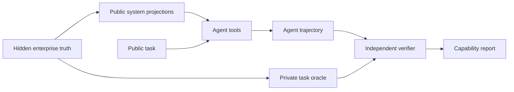

# Veritas

**Independent evaluation and capability-development environments for enterprise AI agents.**

Veritas tests whether an AI agent can investigate, act, recover, and complete operational work inside a controlled synthetic enterprise with hidden ground truth, realistic system disagreement, explicit budgets, authority constraints, and independent verification.

The first commercial package is **Veritas CompanyWorld Pilot v1**.

## What a buyer gets

A design-partner pilot answers a concrete deployment question such as:

- Which model or agent harness should we deploy?
- Where does the agent fail as work becomes multi-step or concurrent?
- Does more test-time compute improve outcomes enough to justify cost?
- Which tool or permission changes improve success without increasing unsafe actions?
- Did a new prompt, model, training run, or architecture produce a credible improvement?

A standard pilot produces a versioned evaluation manifest, private benchmark run, capability scorecard, representative trajectories, failure analysis, cost/tool statistics where available, and prioritized recommendations.

See [`docs/commercial/`](docs/commercial/) for the benchmark card, pilot scope, security boundary, onboarding, acceptance criteria, and procurement material.

## Why the environment is difficult to game



The agent sees only public task state and permitted tool observations. Hidden truth, evaluator targets, benchmark-generation randomness, adversarial pressure, private failure schedules, and verifier oracles remain privileged.

Core integrity properties include:

- strict public/private benchmark separation;
- precision-sensitive task-scoped verification;
- no reward for empty answers, citation laundering, unsupported stuffing, or blindly trusting a conflicting system;
- deterministic generation and replay for fixed versions/seeds;
- disjoint train/IID/OOD/adversarial world plans;
- authority, budget, tool-failure, missingness, conflict, and recovery pressure;
- trace-first execution with verifier-backed outcomes.

## CompanyWorld capability surface

CompanyWorld models a synthetic enterprise through heterogeneous operational systems rather than a single clean database. Current task families span investigation, operational action, sequential control, and dynamic work. Public observations can disagree across systems while private truth remains independently verifiable.

The environment is synthetic: it contains no real people, companies, customer records, or live-internet dependencies. A pilot can therefore evaluate an agent without requiring the buyer to hand over production business data.

## Integration

The fastest pilot path is an OpenAI-compatible model endpoint:

```bash
export VERITAS_MODEL_API_KEY='...'
python tools/run_endpoint_calibration.py \
  --endpoint https://example.internal/v1/chat/completions \
  --model customer-agent \
  --output run.json
```

Veritas also has runtime interfaces for tool-using agents and containerized evaluation work; broader customer-specific adapters are added when a pilot requires them.

## Reproducible run metadata

```bash
python tools/create_evaluation_manifest.py \
  --benchmark-version companyworld-pilot-v1 \
  --benchmark-hash <private-suite-hash> \
  --model customer-agent \
  --harness customer-harness-v1 \
  --attempts-per-task 3 \
  --output manifest.json
```

Private seeds, evaluator oracles, and hidden benchmark truth are never shipped to the evaluated agent.

## Local development

```bash
python -m venv .venv
.venv/bin/pip install -e ".[test]"
.venv/bin/python -m pytest tests/
```

The repository CI validates Python 3.12/3.13, packaging, smoke tests, the Next.js site, Docker startup, dependency/security scanning, and release builds.

## Commercial boundary

The public repository contains the framework, schemas, validation machinery, and buyer-facing methodology. Commercial private-evaluation assets—including frozen private world seeds, hidden ground truth, evaluator oracles, and unreleased adversarial suites—must remain outside the public repository.

Veritas does **not** claim SOC 2 certification, third-party penetration testing, or external benchmark validation at this stage. Those controls should be added in response to actual customer procurement requirements rather than used to delay early design-partner pilots.

> Software version: 0.5.0  
> Commercial benchmark line: Veritas CompanyWorld Pilot v1
