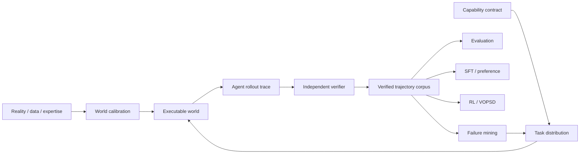

# Veritas

**A verified capability foundry for training and evaluating AI agents in executable, partially observable worlds.**

Veritas builds capability contracts, calibrated world distributions, executable environments, rollout traces, independent verifiers, adversarial challenge sets, verified demonstrations, and trainer-ready bundles for SFT, preference learning, RL, and VOPSD.

The first commercial package is **Veritas CompanyWorld Pilot v1**. CompanyWorld is the first sellable environment and evaluation wedge; it is not the definition of Veritas.

See [`docs/veritas-north-star.md`](docs/veritas-north-star.md) for the permanent architecture and product invariants.

## What a buyer gets today

A design-partner CompanyWorld pilot answers a concrete deployment question such as:

- Which model or agent harness should we deploy?
- Where does the agent fail as work becomes multi-step or concurrent?
- Does more test-time compute improve outcomes enough to justify cost?
- Which tool or permission changes improve success without increasing unsafe actions?
- Did a new prompt, model, training run, or architecture produce a credible improvement?

A standard pilot produces a versioned evaluation manifest, private benchmark run, capability scorecard, representative trajectories, failure analysis, cost/tool statistics where available, and prioritized recommendations.

See [`docs/commercial/`](docs/commercial/) for the benchmark card, pilot scope, security boundary, onboarding, acceptance criteria, and procurement material.

## Capability Foundry architecture



The rollout trace remains the source of truth. Training examples, counterfactuals, failure labels, benchmark reports and expert demonstrations derive from versioned traces rather than separate hand-authored narratives.

## Why the environments are difficult to game

The agent sees only public task state and permitted tool observations. Hidden truth, evaluator targets, benchmark-generation randomness, adversarial pressure, private failure schedules, private calibration targets, and verifier oracles remain privileged.

Core integrity properties include:

- strict public/private benchmark separation;
- precision-sensitive task-scoped verification;
- no reward for empty answers, citation laundering, unsupported stuffing, or blindly trusting a conflicting system;
- deterministic generation and replay for fixed versions/seeds;
- disjoint train/IID/OOD/adversarial world plans;
- authority, budget, tool-failure, missingness, conflict, and recovery pressure;
- trace-first execution with verifier-backed outcomes;
- held-out/OOD trajectories excluded from training bundle compilation;
- expert demonstrations promoted only after verifier and invariant checks.

## Capability families

### CompanyWorld

CompanyWorld models a synthetic enterprise through heterogeneous operational systems rather than a single clean database. Current task families span investigation, operational action, sequential control, and dynamic work. Public observations can disagree across systems while private truth remains independently verifiable.

The environment is synthetic: it contains no real people, companies, customer records, or live-internet dependencies. A pilot can therefore evaluate an agent without requiring the buyer to hand over production business data.

### External Investigation

External Investigation is a distinct capability family for OSINT-style and evidence-heavy work: entity resolution, ownership reconstruction, temporal reconstruction, provenance, conflict resolution, due diligence, hypothesis management, uncertainty and abstention across noisy heterogeneous sources.

It shares Veritas foundry infrastructure with CompanyWorld but has its own capability contract, source surfaces and transfer targets.

### Selective Agency

Selective Agency evaluates whether an agent should **execute, answer, clarify, correct, reframe, decline, or do nothing** given the actual objective and world state. It is designed to measure blind execution, premature action, no-op recognition, false-premise handling, over-refusal, and disproportionate tool use.

The procedural compiler creates paired operational worlds in which similar instructions flip among execute, clarify, no-op, and reframe based on state, authority, guardrails, and hidden consequences. The default distribution contains 240 cases across train, IID test, OOD, and adversarial partitions, with a separate evaluator-only oracle bundle.

```bash
python tools/build_selective_agency_distribution.py \
  --seed 42 \
  --public-output selective_agency_public.json \
  --oracle-output selective_agency_private_oracles.json
```

See [`docs/selective-agency.md`](docs/selective-agency.md) for the task taxonomy, runtime, scoring, and private benchmark boundary.

## Reality-calibrated synthetic worlds

Veritas distinguishes synthetic generation from realism claims. `WorldCalibrationSpec` can capture public datasets, regulatory filings, operational documents, research corpora, expert knowledge and telemetry as provenance-backed calibration inputs. Distribution, dependency, procedure, failure and recovery targets can then be checked before generated worlds are promoted.

Calibration information influences generation and validation; it is not exposed as hidden benchmark truth to the agent.

## Verified trajectory and training products

Raw rollouts are not automatically demonstrations. `ExpertTrajectory`, `ExpertiseAssessment`, `PreferencePair` and `DemonstrationSet` represent verifier-qualified training assets, including expert, recovery, counterfactual and preference trajectories.

`TrainingRecipe`, `TrainingExample` and `TrainingBundle` define the boundary between Veritas and external trainer implementations. The current compiler enforces verifier thresholds, hard-invariant success, split isolation and trace provenance. Concrete trainer runners remain modular integrations.

## Integration

The fastest CompanyWorld pilot path is an OpenAI-compatible model endpoint:

```bash
export VERITAS_MODEL_API_KEY='...'
python tools/run_endpoint_calibration.py \
  --endpoint https://example.internal/v1/chat/completions \
  --model customer-agent \
  --output run.json
```

Veritas also has runtime interfaces for tool-using agents and containerized evaluation work; broader customer-specific adapters are added when a pilot requires them.

## Reproducible run metadata

```bash
python tools/create_evaluation_manifest.py \
  --benchmark-version companyworld-pilot-v1 \
  --benchmark-hash <private-suite-hash> \
  --model customer-agent \
  --harness customer-harness-v1 \
  --attempts-per-task 3 \
  --output manifest.json
```

Private seeds, evaluator oracles, hidden benchmark truth, and unreleased adversarial suites are never shipped to the evaluated agent.

## Local development

```bash
python -m venv .venv
.venv/bin/pip install -e ".[test]"
.venv/bin/python -m pytest tests/
```

The repository CI validates Python 3.12/3.13, packaging, smoke tests, the Next.js site, Docker startup, dependency/security scanning, and release builds.

## Commercial boundary

The public repository contains the framework, schemas, validation machinery, foundry interfaces and buyer-facing methodology. Commercial private-evaluation assets—including frozen private world seeds, hidden ground truth, evaluator oracles, and unreleased adversarial suites—must remain outside the public repository.

Veritas does **not** claim SOC 2 certification, third-party penetration testing, or external benchmark validation at this stage. Those controls should be added in response to actual customer procurement requirements rather than used to delay early design-partner pilots.

> Software version: 0.5.0  
> Commercial benchmark line: Veritas CompanyWorld Pilot v1
