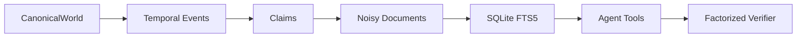

# Investigation World

Investigation World is a deterministic synthetic corporate-investigation environment for training and evaluating research agents. It is not an OSINT system and contains no real people, companies, addresses, or live internet access.

## Architecture



Truth is generated first. Evidence is only a projection of hidden canonical reality, so stale, missing, duplicated, and conflicting sources never alter the oracle.

## Quickstart

```bash
python -m venv .venv
.venv/bin/pip install -e ".[test]"
.venv/bin/python -m pytest tests/
.venv/bin/python -m investigation_world.cli generate-world --seed 42 --output examples/world_001/world.json
.venv/bin/python -m investigation_world.cli render-evidence examples/world_001/world.json --output examples/world_001/evidence.json
```

Run the API with `uvicorn investigation_world.tools.server:app`. Load a generated world through `POST /load?world_path=...`; search only returns public document fields. The canonical world, truth labels, expected answers, and verifier metadata are never returned by agent-facing search/document routes.

## Reproducibility and splits

`WorldFactory.generate(seed, config)` is deterministic. Seeds and generator metadata are stored in each world. Tasks are procedurally generated with `generate_tasks`; use disjoint seed ranges for train, public_eval, and private_eval manifests.

## Extending

Add deterministic renderers over claims, task families through `TaskSpec`, and independent verifier components that return raw scores. SQLite FTS5 is behind `FrozenSearchIndex` so it can later be replaced without changing tool contracts.

## Limitations

This is a functional first vertical slice. Renderer-specific HTML, richer answerability logic, Parquet export, benchmark manifests, and Harbor packaging remain follow-on work. All fixtures use synthetic identifiers and synthetic locations; no network client is implemented.

## Safety boundary

Public document serialization strips canonical identity mappings, truth labels, private provenance metadata, expected answers, and verifier configuration. Privileged canonical data remains in the world object used only by verification.

> Project version: 0.1.0

