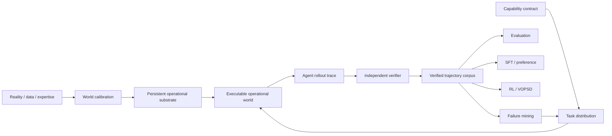

# Veritas

**A verified capability foundry for training and evaluating AI agents in persistent, executable, partially observable operational worlds.**

Veritas builds persistent operational substrates, capability contracts, calibrated world distributions, executable environments, rollout traces, independent verifiers, adversarial challenge sets, verified demonstrations, and trainer-ready bundles for SFT, preference learning, RL, and VOPSD.

The product is broader than any one benchmark family. CompanyWorld remains the first commercial evaluation wedge, while the unified operational-world substrate now provides one execution and verification architecture across finance/spreadsheets, enterprise operations, DevOps/incident response, investigation/OSINT, and GIS.

See [`docs/veritas-north-star.md`](docs/veritas-north-star.md) for the permanent architecture and product invariants and [`docs/unified-operational-worlds.md`](docs/unified-operational-worlds.md) for the shared operational-world substrate.

## What a buyer gets today

A design-partner Veritas engagement can answer concrete deployment questions such as:

- Which model or agent harness should we deploy?
- Where does the agent fail as work becomes multi-step, cross-system, or persistent across time?
- Does more test-time compute improve outcomes enough to justify cost?
- Which tool or permission changes improve success without increasing unsafe actions?
- Can an agent preserve invariants and avoid harmful side effects while reaching the right final state?
- Did a new prompt, model, training run, or architecture produce a credible improvement?

A standard pilot produces a versioned evaluation manifest, private benchmark run, capability scorecard, representative trajectories, failure analysis, cost/tool statistics where available, and prioritized recommendations.

CompanyWorld remains the most mature commercial package. The unified operational suite adds executable reference worlds and a common substrate for expansion into additional economically valuable domains.

See [`docs/commercial/`](docs/commercial/) for the benchmark card, pilot scope, security boundary, onboarding, acceptance criteria, and procurement material.

## Capability Foundry architecture



The rollout trace and independently maintained world state remain the sources of truth. Training examples, counterfactuals, failure labels, benchmark reports and expert demonstrations derive from versioned traces and verifier-backed state rather than separate hand-authored narratives.

## Unified operational-world substrate

`Veritas.build_company()` creates one persistent synthetic organization and mounts all five current operational domains into a shared `PersistentOperationalSubstrate`:

```text
Persistent company state
  + finance / spreadsheet world
  + enterprise operations world
  + DevOps / incident-response world
  + investigation / OSINT world
  + GIS operational world
  -> append-only cross-domain events
  -> deterministic reconstruction
  -> replay / counterfactual forks
  -> independent verification
```

Every operational episode uses the same public/private contract:

- public `TaskContract`;
- agent-visible records and action specifications;
- evaluator-only hidden oracle;
- deterministic action effects;
- target state assertions;
- invariants and authority constraints;
- required and forbidden actions;
- evidence requirements;
- cost and tool-call budgets.

All five domains emit the same seven verification dimensions: **outcome, state, constraints, side effects, process, efficiency, and evidence**. Domain-native verifiers can add richer checks without changing the common product contract.

The canonical Python surface is `investigation_world.veritas.Veritas`. The package also installs a dedicated CLI:

```bash
veritas domains
veritas build-world financial_spreadsheet --seed 42 --output finance.json
veritas build-suite --seed 42 --output suite.json --oracle-output private_oracles.json
veritas build-company --organization-id ORG-DEMO-001 --seed 42 --output company.json
```

Public task bundles and private evaluator oracles are emitted separately.

## Why the environments are difficult to game

The agent sees only public task state and permitted tool observations. Hidden truth, evaluator targets, benchmark-generation randomness, adversarial pressure, private failure schedules, private calibration targets, action consequences, and verifier oracles remain privileged.

Core integrity properties include:

- strict public/private benchmark separation;
- precision-sensitive task-scoped verification;
- no reward for empty answers, citation laundering, unsupported stuffing, or blindly trusting a conflicting system;
- deterministic generation and replay for fixed versions/seeds;
- persistent state with append-only event history and counterfactual forks;
- disjoint train/IID/OOD/adversarial world plans where distributions support them;
- authority, budget, tool-failure, missingness, conflict, and recovery pressure;
- explicit penalties for forbidden actions, invariant violations, harmful side effects, and disproportionate work;
- trace-first execution with verifier-backed outcomes;
- held-out/OOD trajectories excluded from training bundle compilation;
- expert demonstrations promoted only after verifier and invariant checks.

## Capability families

### Unified Operational Worlds

The current operational suite contains five first-class domains under one runtime and verifier contract:

- **Financial / Spreadsheet** — formula repair, dependency reasoning, recalculation, model integrity and valuation-state verification.
- **Enterprise Operations** — cross-system CRM/ERP workflows, approval authority, state consistency and operational controls.
- **DevOps / Incident Response** — observability, service recovery, dependency health, blast-radius control and post-recovery verification.
- **Investigation / OSINT** — evidence-backed entity resolution, provenance and false-merge prevention, bridging the richer External Investigation capability family.
- **GIS Operations** — CRS alignment, topology/geometry repair, artifact preservation and tolerance-aware geospatial state.

The current code provides one executable reference scenario per domain. The next scale layer is procedural task generation plus domain-native artifact engines and deeper shared causal/entity links across the same synthetic company.

### CompanyWorld

CompanyWorld models a synthetic enterprise through heterogeneous operational systems rather than a single clean database. Current task families span investigation, operational action, sequential control and dynamic work. Public observations can disagree across systems while private truth remains independently verifiable.

The environment is synthetic: it contains no real people, companies, customer records or live-internet dependencies. A pilot can therefore evaluate an agent without requiring the buyer to hand over production business data.

### External Investigation

External Investigation is a distinct capability family for OSINT-style and evidence-heavy work: entity resolution, ownership reconstruction, temporal reconstruction, provenance, conflict resolution, due diligence, hypothesis management, uncertainty and abstention across noisy heterogeneous sources.

It shares Veritas foundry infrastructure with CompanyWorld and the unified operational substrate while retaining its own richer investigation capability contract, source surfaces and transfer targets.

### Selective Agency

Selective Agency evaluates whether an agent should **execute, answer, clarify, correct, reframe, decline, or do nothing** given the actual objective and world state. It is designed to measure blind execution, premature action, no-op recognition, false-premise handling, over-refusal and disproportionate tool use.

The procedural compiler creates paired operational worlds in which similar instructions flip among execute, clarify, no-op and reframe based on state, authority, guardrails and hidden consequences. The default distribution contains 240 cases across train, IID test, OOD and adversarial partitions, with a separate evaluator-only oracle bundle.

```bash
python tools/build_selective_agency_distribution.py \
  --seed 42 \
  --public-output selective_agency_public.json \
  --oracle-output selective_agency_private_oracles.json
```

See [`docs/selective-agency.md`](docs/selective-agency.md) for the task taxonomy, runtime, scoring and private benchmark boundary.

## Reality-calibrated synthetic worlds

Veritas distinguishes synthetic generation from realism claims. `WorldCalibrationSpec` can capture public datasets, regulatory filings, operational documents, research corpora, expert knowledge and telemetry as provenance-backed calibration inputs. Distribution, dependency, procedure, failure and recovery targets can then be checked before generated worlds are promoted.

Calibration information influences generation and validation; it is not exposed as hidden benchmark truth to the agent.

## Verified trajectory and training products

Raw rollouts are not automatically demonstrations. `ExpertTrajectory`, `ExpertiseAssessment`, `PreferencePair` and `DemonstrationSet` represent verifier-qualified training assets, including expert, recovery, counterfactual and preference trajectories.

`TrainingRecipe`, `TrainingExample` and `TrainingBundle` define the boundary between Veritas and external trainer implementations. The current compiler enforces verifier thresholds, hard-invariant success, split isolation and trace provenance. Concrete trainer runners remain modular integrations.

## Integration

The fastest CompanyWorld pilot path is an OpenAI-compatible model endpoint:

```bash
export VERITAS_MODEL_API_KEY='...'
python tools/run_endpoint_calibration.py \
  --endpoint https://example.internal/v1/chat/completions \
  --model customer-agent \
  --output run.json
```

Veritas also has runtime interfaces for tool-using agents and containerized evaluation work; broader customer-specific adapters are added when a pilot requires them.

## Reproducible run metadata

```bash
python tools/create_evaluation_manifest.py \
  --benchmark-version companyworld-pilot-v1 \
  --benchmark-hash <private-suite-hash> \
  --model customer-agent \
  --harness customer-harness-v1 \
  --attempts-per-task 3 \
  --output manifest.json
```

Private seeds, evaluator oracles, hidden benchmark truth, and unreleased adversarial suites are never shipped to the evaluated agent.

## Local development

```bash
python -m venv .venv
.venv/bin/pip install -e ".[test]"
.venv/bin/python -m pytest tests/
```

The repository CI validates Python 3.12/3.13, packaging, the legacy investigation pipeline, the unified Veritas operational product surface, the Next.js site, Docker startup, dependency/security scanning, and release builds.

## Commercial boundary

The public repository contains the framework, schemas, validation machinery, foundry interfaces, reference operational worlds and buyer-facing methodology. Commercial private-evaluation assets—including frozen private world seeds, hidden ground truth, evaluator oracles, and unreleased adversarial suites—must remain outside the public repository.

Veritas does **not** claim SOC 2 certification, third-party penetration testing, or external benchmark validation at this stage. Those controls should be added in response to actual customer procurement requirements rather than used to delay early design-partner pilots.

> Software version: 0.6.0  
> Commercial benchmark line: Veritas CompanyWorld Pilot v1  
> Operational substrate line: Veritas Unified Operational Worlds v1
