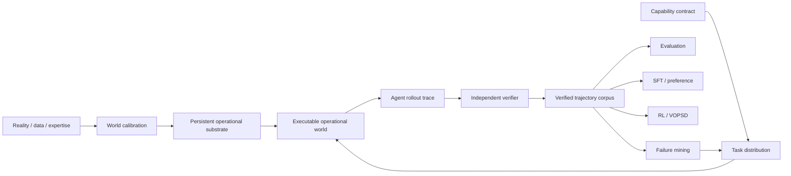

# Veritas

**A verified capability foundry for training and evaluating AI agents in persistent, executable, partially observable operational worlds.**

Veritas builds persistent operational substrates, capability contracts, calibrated world distributions, executable environments, rollout traces, independent verifiers, adversarial challenge sets, verified demonstrations, and trainer-ready bundles for SFT, preference learning, RL, and VOPSD.

The product is broader than any one benchmark family. CompanyWorld remains the first commercial evaluation wedge, while the unified operational-world substrate provides one execution and verification architecture across finance/spreadsheets, enterprise operations, DevOps/incident response, investigation/OSINT, and GIS.

Veritas 0.8 keeps the **4,480 executable episode** production distribution introduced in 0.7 and makes its five operational domains materially deeper: stateful workflow preconditions, ordered procedures, trajectory-wide invariants, temporal/provenance-rich evidence and domain-native operational control surfaces now determine whether an agent actually completed the work correctly.

See [`docs/veritas-north-star.md`](docs/veritas-north-star.md) for the permanent architecture, [`docs/unified-operational-worlds.md`](docs/unified-operational-worlds.md) for the shared substrate, [`docs/operational-production-scale.md`](docs/operational-production-scale.md) for the scale/integrity contract, and [`docs/domain-realism-v08.md`](docs/domain-realism-v08.md) for the deep-domain contract.

## What a buyer gets today

A design-partner Veritas engagement can answer concrete deployment questions such as:

- Which model or agent harness should we deploy?
- Where does the agent fail as work becomes multi-step, cross-system, or persistent across time?
- Does more test-time compute improve outcomes enough to justify cost?
- Which tool or permission changes improve success without increasing unsafe actions?
- Can an agent preserve invariants and avoid harmful side effects while reaching the right final state?
- Did a new prompt, model, training run, or architecture produce a credible improvement?

A standard pilot produces a versioned evaluation manifest, private benchmark run, capability scorecard, representative trajectories, failure analysis, cost/tool statistics where available, and prioritized recommendations.

CompanyWorld remains the most mature commercial package. Unified Operational Worlds provides a production-scale synthetic distribution across five economically relevant domains on the same verified runtime architecture.

See [`docs/commercial/`](docs/commercial/) for the benchmark card, pilot scope, security boundary, onboarding, acceptance criteria, and procurement material.

## Capability Foundry architecture



The rollout trace and independently maintained world state remain the sources of truth. Training examples, counterfactuals, failure labels, benchmark reports and expert demonstrations derive from versioned traces and verifier-backed state rather than separate hand-authored narratives.

## Unified operational-world substrate

`Veritas.build_company()` creates one persistent synthetic organization and mounts all five current operational domains into a shared `PersistentOperationalSubstrate`:

```text
Persistent company state
  + finance / spreadsheet world
  + enterprise operations world
  + DevOps / incident-response world
  + investigation / OSINT world
  + GIS operational world
  -> append-only cross-domain events
  -> deterministic reconstruction
  -> replay / counterfactual forks
  -> independent verification
```

Every operational episode uses the same public/private contract:

- public `TaskContract`;
- agent-visible records and action specifications;
- evaluator-only hidden oracle;
- deterministic hidden action effects;
- hidden state/action preconditions;
- target-state assertions;
- final-state and trajectory-wide invariants;
- required, ordered, repeated and forbidden actions;
- evidence requirements;
- cost and tool-call budgets.

All five domains emit the same seven verification dimensions: **outcome, state, constraints, side effects, process, efficiency, and evidence**. v0.8 deepens how these scores are earned without introducing incompatible domain-specific reward contracts.

## Stateful workflow semantics

A correct action name is no longer enough. Hidden action effects can require prior state or prior successful actions. A syntactically valid request can therefore be rejected by the simulated system when operational prerequisites are not satisfied.

Blocked actions:

- return only an agent-observable system rejection;
- do not mutate hidden truth;
- remain visible to the harness trace as blocked attempts;
- do not satisfy required process credit.

The verifier additionally supports ordered process requirements, repeated required actions and trajectory-wide invariants. An agent cannot temporarily destroy an invariant, repair it before submission, and receive full constraint credit as if no damage occurred.

Agent-visible `OperationalRecord` objects can also carry observation time, validity interval, freshness, source authority, confidence and provenance roots. These are evidence attributes, not evaluator truth.

## Production-scale operational distribution

The default `OperationalDistributionConfig` still compiles **4,480 executable episodes**:

| Split | Per domain | Total |
|---|---:|---:|
| Train | 512 | 2,560 |
| IID test | 128 | 640 |
| OOD | 128 | 640 |
| Adversarial | 128 | 640 |
| **Total** | **896** | **4,480** |

Generation is deterministic and parameterized by domain. OOD cases introduce unfamiliar surface/role conditions. Adversarial cases add conflicting context, tighter resource bounds and stronger pressure. The evaluator bundle retains split, seed, scenario family, difficulty and oracle; the public bundle hides those values and uses opaque IDs plus hash-mixed ordering so split membership cannot be inferred from identifiers or emission order.

The v0.8 deep compiler adds further distribution gates: each generated case must contain domain-native system heterogeneity, temporal/provenance evidence, stateful preconditions, a multi-step ordered procedure and at least one trajectory invariant. Difficulty vectors are recomputed after the deepening pass rather than copied from the shallow template.

Generator-only scenario fields are stripped before public packaging, and validators reject actual private label/key leakage while allowing ordinary domain language such as “identity resolution.”

The required CI workflow compiles and validates the full default distribution with:

```bash
veritas validate-production-scale --seed 42
```

Build a distributable public/private pair with:

```bash
veritas build-distribution \
  --seed 42 \
  --output operational_public.json \
  --oracle-output operational_private.json
```

## Deep domain surfaces

### Financial / Spreadsheet

Cases include workbook manifests, formula-lineage and dependency graphs, calculation chains, source-ledger reconciliation, review context and model-governance controls.

Representative procedure:

```text
inspect formula lineage
-> reconcile authoritative source balance
-> repair formula
-> recalculate
-> validate model controls
```

Recalculation can be blocked until both the formula and authoritative source reconciliation are valid. Source balances and external links can be protected by trajectory-wide invariants.

Artifact contract: `xlsx_formula_dependency_graph_v2`.

### Enterprise Operations

Cases span CRM, CPQ, ERP, IAM and finance-control state. Evidence includes role assignments, quote versions, customer credit profiles, order-line state, account context and immutable audit events.

Representative procedure:

```text
verify actor authority
-> validate credit
-> request approval
-> hold linked order
-> update workflow stage
-> reconcile CPQ / CRM / ERP state
```

Artifact contract: `crm_cpq_erp_control_graph_v2`.

### DevOps / Incident Response

Cases include deployment/change evidence, distributed dependency graphs, logs, SLI windows, SLO policy, observability state and Kubernetes deployment specifications.

Representative procedure:

```text
correlate recent change
-> inspect dependency graph
-> recover the service
-> verify health
-> validate the SLO window
```

The intervention is blocked until the diagnostic scope is established, and apparent recovery does not count as completed work until post-recovery service-level validation succeeds.

Artifact contract: `incident_telemetry_dependency_graph_v2`.

### Investigation / OSINT

Cases include explicit hypotheses, repeated evidence linking, source provenance and independence, identifier crosswalks, negative evidence, historical material and chain-of-custody constraints.

Representative procedure:

```text
record hypothesis
-> resolve candidate identity
-> link multiple evidence roots
-> corroborate independent support
-> close case
```

Repeated claims are not treated as independent corroboration, and ambiguous identities remain separate until supported.

Artifact contract: `multi_source_provenance_casefile_v2`.

### GIS Operations

Cases include dataset-catalog metadata, CRS definitions, datum and axis-order information, spatial extent, topology rule sets, schema profiles, lineage and output contracts.

Representative procedure:

```text
inspect spatial metadata
-> reproject
-> repair geometry
-> validate topology
-> execute overlay
```

The verifier supports threshold/tolerance checks such as maximum output sliver rate while source lineage remains protected.

Artifact contract: `vector_crs_topology_lineage_v2`.

## Product interfaces

The canonical Python surface is `investigation_world.veritas.Veritas`. The package also installs a dedicated CLI:

```bash
veritas capabilities
veritas domains
veritas build-world financial_spreadsheet --seed 42 --output finance.json
veritas build-suite --seed 42 --output suite.json --oracle-output private_oracles.json
veritas build-distribution --seed 42 --output public.json --oracle-output private.json
veritas validate-production-scale --seed 42
veritas build-company --organization-id ORG-DEMO-001 --seed 42 --output company.json
```

Public task bundles and private evaluator oracles are emitted separately.

## Why the environments are difficult to game

The agent sees only public task state and permitted tool observations. Hidden truth, evaluator targets, benchmark-generation randomness, split assignment, adversarial pressure metadata, private action preconditions, hidden consequences, and verifier oracles remain privileged.

Core integrity properties include:

- strict public/private benchmark separation;
- precision-sensitive task-scoped verification;
- no reward for empty answers, citation laundering, unsupported stuffing, or blindly trusting a conflicting system;
- deterministic generation and replay for fixed versions/seeds;
- persistent state with append-only event history and counterfactual forks;
- disjoint train/IID/OOD/adversarial task IDs;
- opaque public IDs and mixed public case ordering;
- stateful procedures instead of verb-matching tasks;
- trajectory-wide invariants in addition to final-state checks;
- authority, budget, conflict and adversarial pressure;
- explicit penalties for forbidden actions, invariant violations, harmful side effects, and disproportionate work;
- trace-first execution with verifier-backed outcomes;
- held-out/OOD trajectories excluded from training bundle compilation;
- expert demonstrations promoted only after verifier and invariant checks.

## Other capability families

### CompanyWorld

CompanyWorld models a synthetic enterprise through heterogeneous operational systems rather than a single clean database. Current task families span investigation, operational action, sequential control and dynamic work. Public observations can disagree across systems while private truth remains independently verifiable.

### External Investigation

External Investigation is the richer investigation capability family for entity resolution, ownership reconstruction, temporal reconstruction, provenance, conflict resolution, due diligence, hypothesis management, uncertainty and abstention across noisy heterogeneous sources.

### Selective Agency

Selective Agency evaluates whether an agent should **execute, answer, clarify, correct, reframe, decline, or do nothing** given the actual objective and world state. Its procedural compiler creates paired worlds in which similar instructions flip among execute, clarify, no-op and reframe based on state, authority, guardrails and hidden consequences.

The default Selective Agency distribution contains 240 cases across train, IID, OOD and adversarial partitions, with a separate evaluator-only oracle bundle. The Continuous Capability Observatory can evaluate these cells longitudinally across world × model × harness × seed × snapshot.

## Reality-calibrated synthetic worlds

Veritas distinguishes synthetic generation from realism claims. `WorldCalibrationSpec` can capture public datasets, regulatory filings, operational documents, research corpora, expert knowledge and telemetry as provenance-backed calibration inputs. Distribution, dependency, procedure, failure and recovery targets can then be checked before generated worlds are promoted.

Calibration information influences generation and validation; it is not exposed as hidden benchmark truth to the agent.

## Verified trajectory and training products

Raw rollouts are not automatically demonstrations. `ExpertTrajectory`, `ExpertiseAssessment`, `PreferencePair` and `DemonstrationSet` represent verifier-qualified training assets, including expert, recovery, counterfactual and preference trajectories.

`TrainingRecipe`, `TrainingExample` and `TrainingBundle` define the boundary between Veritas and external trainer implementations. The compiler enforces verifier thresholds, hard-invariant success, split isolation and trace provenance. Concrete trainer runners remain modular integrations.

## Integration

The fastest CompanyWorld pilot path is an OpenAI-compatible model endpoint:

```bash
export VERITAS_MODEL_API_KEY='...'
python tools/run_endpoint_calibration.py \
  --endpoint https://example.internal/v1/chat/completions \
  --model customer-agent \
  --output run.json
```

Veritas also has runtime interfaces for tool-using agents and containerized evaluation work; broader customer-specific adapters are added when a pilot requires them.

## Reproducible run metadata

```bash
python tools/create_evaluation_manifest.py \
  --benchmark-version companyworld-pilot-v1 \
  --benchmark-hash <private-suite-hash> \
  --model customer-agent \
  --harness customer-harness-v1 \
  --attempts-per-task 3 \
  --output manifest.json
```

Private seeds, evaluator oracles, hidden benchmark truth, and unreleased adversarial suites are never shipped to the evaluated agent.

## Local development

```bash
python -m venv .venv
.venv/bin/pip install -e ".[test]"
.venv/bin/python -m pytest tests/
```

The repository CI validates Python 3.12/3.13, packaging, the legacy investigation pipeline, the unified Veritas product surface, the full 4,480-case deep operational distribution, the Next.js site, Docker startup and dependency/security scanning.

## Commercial and fidelity boundary

The public repository contains the framework, schemas, validation machinery, foundry interfaces, procedural operational generators and buyer-facing methodology. Commercial private-evaluation assets—including frozen private world seeds, hidden ground truth, evaluator oracles, and unreleased adversarial suites—must remain outside the public repository.

Veritas 0.8 is materially deeper at the operational state, evidence, procedure, control and verification layers. It does **not** claim that every domain already embeds a native industrial execution engine. The next fidelity layer includes real XLSX/formula execution, Kubernetes/Terraform/cloud sandboxes, richer enterprise databases/application replicas, larger rendered investigation corpora and native vector/raster GIS execution. Those engines should attach behind the same task/runtime/verifier contract.

Veritas does **not** claim SOC 2 certification, third-party penetration testing or external benchmark validation at this stage.

> Software version: 0.8.0  
> Commercial benchmark line: Veritas CompanyWorld Pilot v1  
> Operational distribution line: Veritas Unified Operational Worlds Production v2
