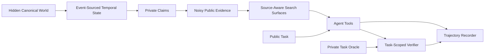

# Investigation World / Veritas

Veritas is a deterministic synthetic corporate-investigation environment for training and evaluating research agents. It contains no real people, companies, addresses, or live-internet access.

## Architecture



The core invariant is that hidden truth, public evidence, public tasks, and verifier oracles are separate objects. Canonical entity IDs, truth labels, answerability, expected relationships, and verifier targets are never returned by agent-facing document/task routes.

## What changed in 0.4.0

- Canonical events now mutate temporal state: ownership transfers close/open relationship intervals, address changes update residence history, renames carry validity periods, and dissolutions terminate active operational relationships.
- Evidence projection no longer places hidden `PER-*`, `ORG-*`, or address IDs in public text. Sources emit aliases/names and source-specific omission, staleness, partial truth, false claims, and citation dependence.
- Tasks are concrete `TaskSpec` instances with a separate privileged `TaskOracle` containing answerability and scoring truth.
- Verification is task-scoped and precision-sensitive. Empty answers, conclusion-only answers, false-positive stuffing, unsupported claims, false merges, temporal mistakes, and citation laundering no longer receive free reward.
- Agent tools are heterogeneous: web, registry, filing, archive, and general document search expose different source families and costs.
- FastAPI episodes are isolated. Each episode has its own hidden world/oracle, search index, task, investigation budget, and automatically recorded trajectory.
- Privileged episode creation/deletion/trajectory routes require an admin token; there is no agent-accessible filesystem world loader.

## Quickstart

```bash
python -m venv .venv
.venv/bin/pip install -e ".[test]"
.venv/bin/python -m pytest tests/

.venv/bin/python -m investigation_world.cli generate-world \
  --seed 42 --output /tmp/world.json
.venv/bin/python -m investigation_world.cli render-evidence \
  /tmp/world.json --seed 42 --output /tmp/evidence.json
.venv/bin/python -m investigation_world.cli generate-tasks \
  /tmp/evidence.json \
  --output /tmp/tasks.json \
  --oracle-output /tmp/oracles.json \
  --count 48 --seed 42
```

Keep oracle artifacts private from agents and public benchmark participants.

## API episode model

Set an orchestration secret before exposing admin routes:

```bash
export VERITAS_ADMIN_TOKEN='replace-with-a-long-random-secret'
uvicorn investigation_world.tools.server:app
```

A privileged orchestrator creates an episode with `POST /admin/episodes`, supplying a hidden `CanonicalWorld` and optionally a matching public task/private oracle. Admin requests must include `X-Veritas-Admin-Token`. If task/oracle are omitted, the server generates a pair internally. The response contains only the episode ID and public task.

Privileged orchestration routes:

- `POST /admin/episodes`
- `DELETE /admin/episodes/{episode_id}`
- `GET /admin/episodes/{episode_id}/trajectory`

Agent-facing routes are episode-scoped:

- `GET /episodes/{episode_id}/task`
- `POST /episodes/{episode_id}/search/web`
- `POST /episodes/{episode_id}/search/documents`
- `POST /episodes/{episode_id}/registry/search`
- `POST /episodes/{episode_id}/filings/search`
- `POST /episodes/{episode_id}/archive/search`
- `GET /episodes/{episode_id}/documents/{document_id}`
- `GET /episodes/{episode_id}/budget`
- `POST /episodes/{episode_id}/submit`

Tool observations, final structured findings, verifier output, budget consumption, and failure labels are captured in the episode trajectory. The privileged trajectory route can be used for RL/evaluation export without exposing hidden oracle state to the agent.

## Reproducibility

`WorldFactory.generate(seed, config)` and evidence projection are deterministic for a fixed seed/configuration. Generator/projection metadata is stored in the privileged world. Use disjoint world seeds for train, public evaluation, and private evaluation sets.

## CI/CD

The repository includes GitHub Actions for:

- Python 3.12/3.13 tests and source compilation
- wheel/sdist build validation
- end-to-end world → evidence → task/oracle → search smoke testing
- Next.js type-check/build
- Docker build validation
- dependency/security scanning
- tag-gated GitHub Releases and GHCR publishing
- Dependabot maintenance

The stable branch-protection check is `CI / Required`.

## Current limitations

This remains a synthetic benchmark substrate, not a complete commercial environment. Renderer realism, larger adversarial transformation libraries, stronger evidence entailment models, benchmark manifest tooling, private-eval storage, external harness adapters, and distributed/persistent episode storage remain follow-on work.

> Project version: 0.4.0
